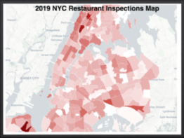

## Visualization and Analysis for - New York City Restaurant Inspection Results
***

### What is this app?

This is a simple Shiny application created as part of the [ DATA 608, Knowledge and Visual Analytics ] course offered by City University Of New York's (CUNY) Online Masters in Data Science.

The app allows a user to Analyze the New York City Restaurant Inspection Results. Look for top reason of citations. Looks for restuarnts with repeated vilations. Visualization of the result in an NYC Map using Shiny App. The dataset contains every sustained or not yet adjudicated violation citation from every full or special program inspection conducted up to three years prior to the most recent inspection for restaurants and college cafeterias. 

The data is sourced from [DOHMH New York City Restaurant Inspection Results | NYC Open Data](https://data.cityofnewyork.us/Health/DOHMH-New-York-City-Restaurant-Inspection-Results/43nn-pn8j). The data is provided in _csv_ format.

### How do I use it?

Navigate through the app using the tabs at the top. Further detail and instruction are provided on each tab. 

